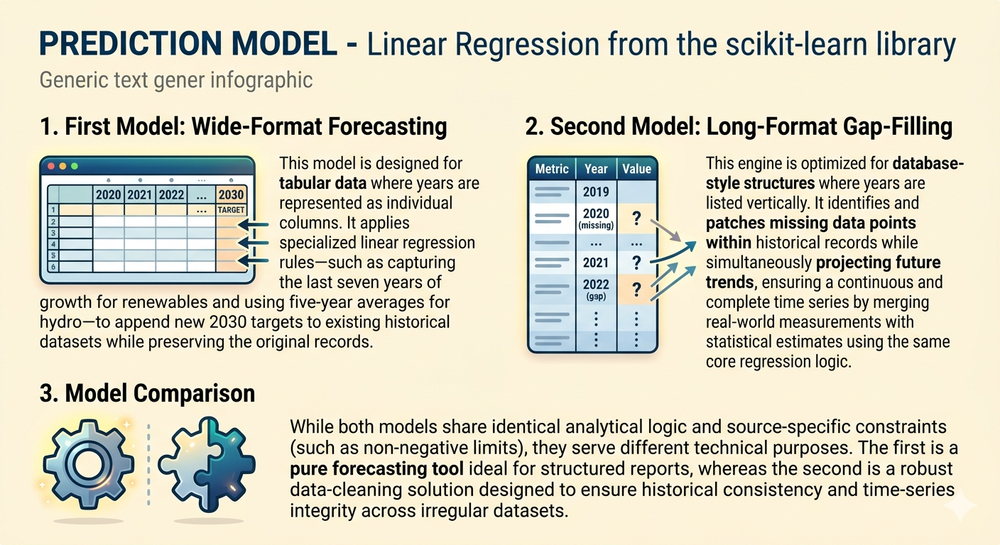

<style>

body, .dashboard-page, .dashboard-container { 
  background-color: #FFF8E7 !important; 
}

.navbar { 
  background-color: #003366 !important; 
}


.navbar-author, .quarto-dashboard-author { 
  display: none !important; 
}

.navbar-title::after {
  content: "Author: Francesco Eirado Enes";
  display: block;
  font-size: 0.5em;
  font-weight: 300;
  color: #B0B0B0;
  margin-top: 5px;
  text-align: left;
  text-transform: none;
  line-height: 1.2;
}

.custom-cream-box {
  text-align: center !important;
  border: 2px solid #B0B0B0 !important;
  padding: 35px !important;
  border-radius: 15px !important;
  background-color: #FFF8E7 !important; 
  box-shadow: 0px 8px 20px rgba(0, 0, 0, 0.1) !important;
  max-width: 1200px !important;
  margin: 35px auto !important;
  display: block !important;
}


.intro-text {
  text-align: center;
  margin: 30px auto;
  max-width: 1000px;
  background-color: #FFF8E7; 
  border: 2px solid #B0B0B0; 
  border-radius: 15px;       
  padding: 25px 40px;        
  box-shadow: 0px 6px 15px rgba(0, 0, 0, 0.08); 
}
h3 { color: #003366; font-weight: bold; font-size: 32px; }
p { color: #4c4c4c; font-size: 18px; }
iframe { display: block; margin: 0 auto 20px auto; }
</style>

# 📖 Overview

::: {.intro-text}
<h3>PROJECT OVERVIEW</h3>
<p>A proper understanding of this project requires first clarifying the analytical methodology, the underlying data sources, the tools used throughout the process, and the key terminology of the energy sector.</p>
:::




<div class="custom-cream-box">
  <span style="font-size:24px; font-weight:800; color: #8B0000;">
    ⚠️ ATTENTION ⚠️
  </span>
  <br><br>
  <span style="font-size:18px; color: #383838; line-height: 1.5;">
    It is highly recommended to <b>refresh the page</b> every time you switch sections in the dashboard to ensure the correct rendering of the interactive Plotly charts.
  </span>
</div>


# 🌍 Global Evolution

::: {.intro-text}
<h3>EVOLUTION OF GLOBAL ENERGY CONSUMPTION</h3>
<p>Let’s begin with a global overview of how energy production has evolved, to get a clear sense of the worldwide trajectory from 2000 to 2024.</p>
:::
<iframe src="Plot/00_global_energy_stacked_area.html" width="100%" height="680px" style="border:none;"></iframe>
<div class="custom-cream-box">

<span style="font-size:22px; font-weight:700;">
Global Energy Consumption by Source: An Upward Trajectory<br>
</span>

<br>

<span style="font-size:18px;">
This stacked area chart illustrates the absolute growth in global energy demand since the year 2000, measured in Terawatt-hours (TWh).<br>
While low-carbon sources like renewables and nuclear (the green and blue bands) have grown significantly over the last two decades, this growth has primarily served to meet <i>new</i> energy demand rather than replacing existing fossil fuel use.<br>
Consequently, despite the clean energy boom, total fossil fuel consumption (the large orange area) continues to rise in absolute terms.
</span>
</div>
<hr style="width: 90%; border: 1px solid #B0B0B0; margin: 50px auto;">
<iframe src="Plot/01_global_energy_shares.html" width="100%" height="680px" style="border:none;"></iframe>
<div class="custom-cream-box">
<span style="font-size:22px; font-weight:700;">
Global Energy Mix Share: The Slow Pace of the Transition<br>
</span>
<br>
<span style="font-size:18px;">
This 100% stacked bar chart provides a proportional view of the global energy mix, highlighting the persistent dominance of fossil fuels.<br>
As the orange bars show, fossil fuels have consistently accounted for over 80% of total primary energy consumption throughout the 21st century.<br>
Although the relative share of renewables (green) is slowly expanding and gradually eating into the fossil fuel percentage, the overall shift in the energy mix remains sluggish compared to the pace required to meet global climate targets.
</span>
</div>
<hr style="width: 90%; border: 1px solid #B0B0B0; margin: 50px auto;">
<iframe src="Plot/02_global_fossil_shares.html" width="100%" height="680px" style="border:none;"></iframe>
<div class="custom-cream-box">
<span style="font-size:22px; font-weight:700;">
Inside the Fossil Fuel Dominance<br>
</span>
<br>
<span style="font-size:18px;">
This stacked area chart breaks down the composition of the massive fossil fuel block.<br>
It highlights that within the ~80% of global energy still derived from fossil sources, Oil remains the dominant fuel, closely followed by Coal and Natural Gas.<br>
Despite a slight percentage decrease in the overall fossil share in recent years, the persistent and massive reliance on these three highly carbon-intensive fuels underscores the sheer scale of the global decarbonization challenge.
</span>
</div>
<hr style="width: 90%; border: 1px solid #B0B0B0; margin: 50px auto;">
<iframe src="Plot/03_global_ren_shares.html" width="100%" height="680px" style="border:none;"></iframe>
<div class="custom-cream-box">
<span style="font-size:22px; font-weight:700;">
The Shifting Makeup of Clean Energy<br>
</span>
<br>
<span style="font-size:18px;">
This chart details the internal evolution of low-carbon energy sources, which together still account for less than 20% of the global mix.<br>
Historically, Nuclear (purple) and Hydroelectric power (blue) provided the solid foundation of the world's clean energy base.<br>
However, a new dynamic is clearly visible in recent years: the relative share of nuclear power has gradually declined, while the recent overall expansion in the clean energy sector is almost entirely driven by the rapid, accelerating deployment of modern renewables like Wind (green) and Solar (yellow).
</span>
</div>
<hr style="width: 90%; border: 1px solid #B0B0B0; margin: 50px auto;">
<iframe src="Plot/04_global_tree.html" width="100%" height="700px" style="border:none;"></iframe>
<div class="custom-cream-box">
<span style="font-size:22px; font-weight:700;">
The Current Global Energy Landscape<br>
</span>
<br>
<span style="font-size:18px;">
This treemap provides a clear, proportional snapshot of the world's current energy consumption mix.<br>
The vast size of the orange "Fossil Fuels" rectangle visually emphasizes its continued stronghold on the global economy, with Oil and Gas alone accounting for over half of all energy used.<br>
In stark contrast, the green "Renewables" and blue "Nuclear" sections occupy a much smaller footprint. While modern sources like Solar and Wind are growing rapidly in media attention and capacity, this chart grounds us in the reality that they still represent a very small fraction of total global energy demand.
</span>
</div>
<hr style="width: 90%; border: 1px solid #B0B0B0; margin: 50px auto;">

# 🏦 Income Groups

::: {.intro-text}
<h3>FOCUS ON WORLD BANK INCOME GROUPS</h3>
<p>I transitioned from a broad global overview to a segmented analysis using official World Bank income groups to better reflect global economic diversity.<br>This methodology follows the Our World in Data standard for constructing regional aggregates and calculating energy efficiency metrics relative to GDP.</p>
:::

<iframe src="Plot/05_income_bar.html" width="100%" height="850px" style="border:none;"></iframe>
<div class="custom-cream-box">

<span style="font-size:22px; font-weight:700;">
Energy Consumption Across Income Groups: The Development Challenge<br>
</span>

<br>

<span style="font-size:18px;">
This animated bar chart reveals the stark reality of global economic development and its historical reliance on fossil fuels over the last two decades.<br>
As the timeline progresses, we see a dramatic surge in total energy consumption, particularly within the "Upper-middle-income" group, as developing nations rapidly industrialize to raise their citizens' living standards.<br>
Crucially, the massive, expanding orange bars demonstrate that this explosive new energy demand has been met almost entirely by fossil fuels. While "High-income" nations show a larger integration of nuclear and renewables (blue and green), the animation clearly underscores that the current, proven pathway to economic prosperity remains deeply carbon-intensive.
</span>

</div>
<hr style="width: 90%; border: 1px solid #B0B0B0; margin: 50px auto;">
<iframe src="Plot/06_income_map.html" width="100%" height="800px" style="border:none;"></iframe>
<div class="custom-cream-box">

<span style="font-size:22px; font-weight:700;">
Mapping Global Economic Evolution<br>
</span>

<br>

<span style="font-size:18px;">
Thanks to this interactive map, we can quickly visualize the economic development of nations across the globe.<br>
It serves as a practical tool to easily identify which specific countries belong to the different World Bank income groups at any given time.<br>
Crucially, by animating through the timeline, it allows us to track these dynamic shifts and see exactly how countries transition between economic classifications over the years.
</span>

</div>
<hr style="width: 90%; border: 1px solid #B0B0B0; margin: 50px auto;">

<iframe src="Plot/07_income_scatter.html" width="100%" height="850px" style="border:none;"></iframe>
<div class="custom-cream-box">

<span style="font-size:22px; font-weight:700;">
The Dual Challenge: Energy Efficiency vs. Carbon Intensity<br>
</span>

<br>

<span style="font-size:18px;">
This animated scatter plot dissects the core mechanics of the global energy transition. It tracks countries across two critical metrics: <b>Energy per GDP</b> on the X-axis (economic efficiency) and <b>Carbon Intensity</b> on the Y-axis (how polluting the energy mix is). The ultimate goal for every nation is the bottom-left quadrant—highly efficient economies powered by clean energy.<br><br>
Watching the animation over two decades reveals a clear and powerful trend: a massive, collective drift of the bubbles to the <i>left</i>. This represents a global triumph in energy efficiency; across all income groups, nations are successfully generating more economic wealth (GDP) for every unit of energy they consume.<br><br>
However, the lack of a strong, unified <i>downward</i> movement exposes the difficult reality of the climate crisis. While we have learned to use energy much more efficiently to build our economies, the actual energy we are burning remains stubbornly carbon-intensive, particularly in rapidly industrializing middle-income nations. We are doing more with less, but the "less" is still mostly fossil fuels.
</span>

</div>
<hr style="width: 90%; border: 1px solid #B0B0B0; margin: 50px auto;">

# 📊 Country Patterns

::: {.intro-text}
<h3>DISCOVERING ENERGY PATTERNS ACROSS COUNTRIES</h3>
<p>I am now narrowing the focus to individual country behaviors, where you will find a variety of insights and curiosities regarding how different nations approach their energy transitions.<br>By examining several Top‑25 rankings across the renewable, fossil, and nuclear sectors, this section uncovers the specific strategies that allow certain countries to emerge as “Sustainable Leaders” while others remain “Fossil Dependent”.</p>
:::

<iframe src="Plot/08_countries_barh.html" width="100%" height="850px" style="border:none;"></iframe>
<div class="custom-cream-box">

<span style="font-size:22px; font-weight:700;">
The Heavyweights: Top 25 Energy Consumers<br>
</span>

<br>

<span style="font-size:18px;">
This animated bar chart ranks the world's top 25 energy consumers, providing a stark visualization of the massive scale and shifting center of gravity in global energy demand.<br><br>
The defining feature of the last two decades is the unparalleled, explosive growth of China. While advanced economies like the United States show stabilizing total energy use—and several European nations even show slight declines while slowly substituting fossil fuels (orange) for renewables (green)—the rapid industrialization of China and India has driven massive absolute increases in global fossil fuel consumption.<br><br>
However, the final snapshot in 2024 also highlights an important duality: while China burns vastly more fossil fuels than any other nation, the sheer scale of its recent investments in clean energy means that its green "renewables" block alone is now larger than the total energy consumption of many fully developed countries.
</span>

</div>
<hr style="width: 90%; border: 1px solid #B0B0B0; margin: 50px auto;">
<iframe src="Plot/09_countries_scatter_fossil.html" width="100%" height="850px" style="border:none;"></iframe>
<div class="custom-cream-box">

<span style="font-size:22px; font-weight:700;">
Wealth vs. Fossil Dependency: The Decoupling Challenge<br>
</span>

<br>

<span style="font-size:18px;">
This animated chart illustrates the historical positive correlation between economic wealth (GDP per Capita) and fossil fuel dependency.<br><br>
As nations grow richer and move to the right, their per‑capita fossil consumption and resulting emissions (represented by the larger bubbles and darker, more intense colors) tend to rise sharply along the red trendline.<br><br>
The ultimate challenge of the global energy transition is <i>decoupling</i>—breaking this historical trendline so that countries can continue to grow and prosper economically while simultaneously reducing their reliance on fossil fuels.
</span>

</div>
<hr style="width: 90%; border: 1px solid #B0B0B0; margin: 50px auto;">

<iframe src="Plot/10_final_economic_transition.html" width="100%" height="850px" style="border:none;"></iframe>
<div class="custom-cream-box">

<span style="font-size:22px; font-weight:700;">
The Renewable Frontier: Effort vs. Economic Return<br>
</span>

<br>

<span style="font-size:18px;">
This animated scatter plot explores the relationship between a country's historical commitment to green energy and its overall economic efficiency. The X-axis tracks "Cumulative Renewable Production per Capita," effectively measuring a nation's long-term experience and sustained investment in renewable technologies.<br><br>
As the animation progresses over the decades, we observe the bubbles moving to the right and growing larger (indicating increasing technological effort). Crucially, as they move right, the color of many bubbles shifts from warm colors to green, demonstrating that accumulating renewable capacity successfully and tangibly drives down overall carbon intensity.<br><br>
While the slightly downward-sloping trendline indicates that the absolute highest per-capita producers of renewables don't necessarily extract the highest GDP per unit of energy (often due to specific, highly energy-intensive industries located in those progressive nations), the chart clearly illustrates a growing global momentum toward a cleaner, technology-driven energy frontier.
</span>

</div>
<hr style="width: 90%; border: 1px solid #B0B0B0; margin: 50px auto;">
<iframe src="Plot/11_countries_growth_ren.html" width="100%" height="850px" style="border:none;"></iframe>
<div class="custom-cream-box">

<span style="font-size:22px; font-weight:700;">
Breaking Down the Renewable Boom<br>
</span>

<span style="font-size:18px;">
This visualization deconstructs the per‑capita growth of renewable electricity generation from 2000 to 2024.
</span>
<br><br>
<span style="font-size:22px; font-weight:700;">
Key Analytical Insights
</span>
<span style="font-size:18px;">
<br>
<b>• Diversified Growth:</b> While the overall net growth (annotated at the end of each bar) establishes the global ranking,<br> the color segmentation reveals the specific technological drivers for each nation—for example, the dominance of Wind and Solar across Northern Europe.

<b>• Negative Components:</b> The relative bar mode highlights structural shifts within national energy systems. Negative segments extending leftward (such as declining Hydro output in certain regions)<br>show that scaling modern green technologies like Solar and Wind is often required simply to compensate for the decline or retirement of older legacy renewable infrastructures.

</span>

</div>
<hr style="width: 90%; border: 1px solid #B0B0B0; margin: 50px auto;">
<iframe src="Plot/12_countries_growth_fossil.html" width="100%" height="850px" style="border:none;"></iframe>
<div class="custom-cream-box">

<span style="font-size:22px; font-weight:700;">
Fossil Fuels: The Lingering Legacy<br>
</span>
<span style="font-size:18px;">
This visualization serves as the direct counterpart to the renewable growth analysis, focusing on the expansion (and contraction) of fossil fuel dependency from 2000 to 2024.<br><br>
</span>
<span style="font-size:22px; font-weight:700;">
Key Analytical Insights
</span>
<br>
<span style="font-size:18px;">
<b>• Persistent Growth:</b> Net positive values on the right reveal the nations still expanding their high‑carbon energy systems, often driven by rapid industrialization and rising energy demand.<br>
<b>• The Phase‑Out (Negative Growth):</b> The relative bar mode is essential here. Segments extending leftward (negative growth) represent the structural phase‑out of legacy fossil sources.<br> A large negative Coal or Oil bar is a strong indicator of an electricity grid undergoing active and successful decarbonization.

</span>

</div>
<hr style="width: 90%; border: 1px solid #B0B0B0; margin: 50px auto;">


# ⚛️ Nuclear Efficiency

::: {.intro-text}
<h3>NUCLEAR EFFICIENCY AND ITS ROLE IN THE GREEN TRANSITION</h3>
<p>Is nuclear energy essential for the energy transition thanks to its extremely high real efficiency—producing far more continuous, reliable electricity per unit of installed capacity while generating zero emissions?</p>
:::

<iframe src="Plot/13_renewables_gap.html" width="100%" height="850px" style="border:none;"></iframe>
<iframe src="Plot/14_lowcarbon_gap.html" width="100%" height="850px" style="border:none;"></iframe>
<div class="custom-cream-box">

<span style="font-size:22px; font-weight:700;">
The Clean Energy Deficit: Mind the Gap<br>
</span>

<br>

<span style="font-size:18px;">
These twin charts expose the stark reality of the global energy mix by calculating the per-capita "Gap" between clean energy and fossil fuel consumption. A bar extending to the right (green or blue) indicates a true clean energy surplus, while a bar pointing left (brown or purple) reveals a fossil fuel deficit.<br><br>
The top chart (Renewables vs. Fossils) highlights just how rare a true renewable surplus is, with only unique geographic outliers like Iceland and Norway achieving significant positive gaps. Almost every other nation operates at a deep fossil deficit.<br><br>
The bottom chart broadens the "clean" definition to include Nuclear power (Low-Carbon vs. Fossils). While this addition pushes a few more technologically advanced nations (like Sweden and Switzerland) across the zero line into surplus territory, the overwhelming visual takeaway across all analyzed time periods remains the persistent, deep-seated fossil fuel dependence of the global economy.
</span>

</div>
<hr style="width: 90%; border: 1px solid #B0B0B0; margin: 50px auto;">

<iframe src="Plot/15_nuclear_scatter.html" width="100%" height="850px" style="border:none;"></iframe>
<div class="custom-cream-box">

<span style="font-size:22px; font-weight:700;">
The Nuclear Effect: Share vs. Carbon Intensity
</span>
<br>
<span style="font-size:18px;">
This visualization isolates the impact of atomic energy on grid decarbonization, plotting the <i>Nuclear Share in the Electricity Mix</i> (X‑axis) against overall <i>Carbon Intensity</i> (Y‑axis).
</span>
<br>
<br>
<span style="font-size:22px; font-weight:700;">
Key Analytical Insights
</span>
<br>
<span style="font-size:18px;">
<b>• The Decarbonization Trend:</b>
The dashed OLS trendline reveals a clear and robust negative correlation.<br>
Countries with a high nuclear share (moving right) consistently achieve much lower carbon intensity (moving downward), demonstrating nuclear energy’s strong effectiveness in rapid grid decarbonization.
<br>
<br>
<b>• The Phase‑Out Phenomenon (Disappearing Nations):</b>
A unique aspect of the animation is that some bubbles vanish over time. This visually represents political nuclear phase‑outs (e.g., Germany).<br>
As these nations decommission reactors and their nuclear share falls to zero, they disappear from the nuclear landscape entirely.
<br>

<b>• Economic Efficiency:</b>The color scale (<i>Economic Gain</i>) adds a third analytical layer, showing that high nuclear dependency does not hinder economic performance.<br>Several high‑nuclear countries maintain strong structural efficiency while achieving deep decarbonization.
</span>

</div>
<hr style="width: 90%; border: 1px solid #B0B0B0; margin: 50px auto;">
<iframe src="Plot/16_nuclear_box.html" width="100%" height="850px" style="border:none;"></iframe>
<div class="custom-cream-box">

<span style="font-size:22px; font-weight:700;">
The Capacity Paradox: Installed GW vs. Actual Generation<br>
</span>

<br>

<span style="font-size:18px;">
This box plot reveals a critical, yet often misunderstood aspect of the energy transition: the vast difference between a power plant's "installed capacity" (measured in GW) and its "actual energy generated" (measured in TWh). <i>Note: The theoretical physical maximum is 8.76 TWh per GW per year.</i><br><br>
The data clearly demonstrates that 1 GW of capacity is not created equal across technologies. Nuclear power operates reliably near its physical limit, acting as a stable baseload. In contrast, weather-dependent renewables like Solar and Wind inherently possess much lower real-world energy yields per installed unit.<br><br>
This highlights the "Capacity Paradox"—we cannot evaluate the energy transition merely by comparing the GW of new solar/wind additions directly to the GW of retiring traditional plants. To replace the actual electricity generated by a single GW of firm nuclear or fossil baseload, we must build several GWs of renewable capacity to compensate for their intermittency.
</span>

</div>
<hr style="width: 90%; border: 1px solid #B0B0B0; margin: 50px auto;">


# 🗺️ The Paradox

::: {.intro-text}
<h3>THE TRANSITION PARADOX:  
POWER GRID VS REAL ECONOMY</h3>
<p>While many nations have almost fully decarbonized their <b>Electricity Grid</b> (left), the dependence on hydrocarbons in transport and industry keeps <b>Total Energy Consumption</b> (right) still dramatically tied to fossil fuels.</p>
:::

```{=html}
<div class="intro-text" style="padding: 15px 40px; margin-top: -10px; margin-bottom: 35px;">
  <div style="display: flex; flex-direction: row !important; justify-content: center; align-items: center; gap: 30px; flex-wrap: nowrap; width: 100%; color: #383838; font-family: sans-serif; font-weight: bold; font-size: 16px;">
    <div style="display: flex; align-items: center; gap: 8px;"><span style="display:inline-block; width:18px; height:18px; background-color:rgb(212,175,55); border-radius:4px;"></span> Low-carbon > Fossil</div>
    <div style="display: flex; align-items: center; gap: 8px;"><span style="display:inline-block; width:18px; height:18px; background-color:rgb(135,206,250); border-radius:4px;"></span> Balanced</div>
    <div style="display: flex; align-items: center; gap: 8px;"><span style="display:inline-block; width:18px; height:18px; background-color:rgb(139,26,26); border-radius:4px;"></span> Low-carbon not sufficient</div>
    <div style="display: flex; align-items: center; gap: 8px;"><span style="display:inline-block; width:18px; height:18px; background-color:rgb(59,0,0); border-radius:4px;"></span> Fossil giant</div>
    <div style="display: flex; align-items: center; gap: 8px;"><span style="display:inline-block; width:18px; height:18px; background-color:rgb(200,200,200); border-radius:4px;"></span> No Data</div>
  </div>
</div>

<div style="background-color: #FFF8E7; border: 2px solid #B0B0B0; border-radius: 15px; padding: 40px 20px; box-shadow: 0px 6px 15px rgba(0, 0, 0, 0.08); margin-bottom: 40px; width: 100%;">
  
  <div style="display: flex; flex-direction: row !important; justify-content: space-between; align-items: flex-start; gap: 2%; width: 100%; flex-wrap: nowrap;">
    <div style="width: 49%; display: flex; flex-direction: column; align-items: center;">
      <div style="text-align:center; border:2px solid #B0B0B0; padding:10px 30px; background-color: #FFF8E7; border-radius:12px; margin-bottom: 20px; box-shadow: 0px 4px 10px rgba(0,0,0,0.05); width: fit-content;">
        <span style="color: #003366; font-weight: bold; font-size: 18px; text-transform: uppercase;">Electricity Grid</span>
      </div>
      <iframe src="Plot/17_global_map_ele.html" style="width: 100%; height: 750px; border:none; display: block;"></iframe>
    </div>

    <div style="width: 49%; display: flex; flex-direction: column; align-items: center;">
      <div style="text-align:center; border:2px solid #B0B0B0; padding:10px 30px; background-color: #FFF8E7; border-radius:12px; margin-bottom: 20px; box-shadow: 0px 4px 10px rgba(0,0,0,0.05); width: fit-content;">
        <span style="color: #003366; font-weight: bold; font-size: 18px; text-transform: uppercase;">Total Energy Consumption</span>
      </div>
      <iframe src="Plot/18_global_map_cons.html" style="width: 100%; height: 750px; border:none; display: block;"></iframe>
    </div>
  </div>
</div>

<div style="text-align:center; border:2px solid #383838; padding:30px; border-radius:15px; background-color: #FFF8E7; box-shadow: 0px 4px 15px rgba(0,0,0,0.08);">

<div style="text-align:center; border:2px solid #383838; padding:25px; border-radius:12px;">

<span style="font-size:22px; font-weight:700;">
The Illusion of Green Grids: Electricity vs. Total Primary Consumption<br>
</span>

<br>

<span style="font-size:18px;">
This dual 3D visualization highlights the critical discrepancy between a nation's electrical grid (Map 1) and its total primary energy consumption (Map 2).
</span>

<br><br>

<span style="font-size:22px; font-weight:700;">
Methodological Alignment<br>
</span>

<span style="font-size:18px;">
To ensure a rigorous visual comparison, geographical coverage is strictly synchronized. 
Total primary consumption data—which includes heating, industrial manufacturing, and transportation—is often unavailable for smaller economies.<br>
We have therefore filtered Map 1 to include only the countries present in Map 2, ensuring a perfectly consistent "No Data" baseline and preventing visual artifacts between the two views.
</span>

<br><br>

<span style="font-size:22px; font-weight:700;">
Key Analytical Findings
</span>

<br>

<span style="font-size:18px;">
Comparing the two maps reveals what we call the <i>Green Grid Illusion</i>. 
Many developed nations appear highly decarbonized when looking only at their electricity generation (Map 1, shifting toward <b>Gold</b> or <b>Soft Blue</b>).<br>
However, Map 2 exposes the broader economic reality: once heavy industry, transportation, and heating are included, the map shifts dramatically toward <b>Dark Red</b> (“Fossil Giants”).<br>
This demonstrates that while cleaning the power grid is a vital milestone, the true challenge of the global energy transition lies in the deep electrification of the entire real economy.
</span>

</div>

</div>

```
# 🎯 Global Targets 2030

::: {.intro-text}
<h3>GLOBAL VS TARGET 2030</h3>
<p>EMBER targets represent the critical intermediate milestones required to align with the Paris Agreement and limit global warming to 1.5°C. These parameters define the renewable capacity and emission reductions needed by 2030 to achieve Net Zero by 2050. This dashboard compares real-world data against these projections to measure our distance from a sustainable climate trajectory.</p>
:::

<iframe src="Plot/19_prediction_donut.html" width="100%" height="850px" style="border:none;"></iframe>
<div class="custom-cream-box">

<span style="font-size:22px; font-weight:700;">
The Global Scorecard: A Reality Check for 2030<br>
</span>

<br>

<span style="font-size:18px;">
This donut chart provides a high-level summary of the global progress toward 2030 energy targets. By aggregating performance across all metrics—from solar expansion to coal reduction—it reveals that over half of the tracked progress is currently "Failing" (Red). While a significant portion is "Exceeding Goal" (Green), the "On Track" (Yellow) segment remains small, highlighting the urgent need to accelerate transitions in lagging sectors to avoid missing the decade's critical milestones.
</span>

</div>
<hr style="width: 90%; border: 1px solid #B0B0B0; margin: 50px auto;">

<iframe src="Plot/20_prediction_bar.html" width="100%" height="850px" style="border:none;"></iframe>
<div class="custom-cream-box">

<span style="font-size:22px; font-weight:700;">
Sectoral Breakdown: Where We Are Winning and Losing<br>
</span>

<br>

<span style="font-size:18px;">
This bar chart decomposes the 2030 targets by specific energy metrics, showing how many countries fall into each status category. It uncovers a striking disparity: while sectors like Solar Capacity show a high volume of countries exceeding their goals, others like Coal and Biofuel are struggling significantly. This visualization identifies the specific "bottleneck" technologies that are preventing a unified global success, allowing for a targeted analysis of which energy sources require the most policy intervention.
</span>

</div>
<hr style="width: 90%; border: 1px solid #B0B0B0; margin: 50px auto;">

<iframe src="Plot/21_prediction_box.html" width="100%" height="850px" style="border:none;"></iframe>
<div class="custom-cream-box">

<span style="font-size:22px; font-weight:700;">
The Depth of the Gap: Measuring the Distance to Success<br>
</span>

<br>

<span style="font-size:18px;">
Beyond simple "Pass/Fail" metrics, this box plot measures the statistical distribution of the <i>gap depth</i>—how far countries actually are from their 2030 targets. Positive values (Green) represent over-achievement, while negative values (Red) show the percentage deficit. The wide whiskers in sectors like Wind and Hydro indicate extreme variance: some nations are performing exponentially better than required, while a large cluster remains trapped near the bottom, facing a daunting climb to reach their promised capacity.
</span>

</div>
<hr style="width: 90%; border: 1px solid #B0B0B0; margin: 50px auto;">

<iframe src="Plot/22_prediction_radar.html" width="100%" height="1000px" style="border:none;"></iframe>
<div class="custom-cream-box">

<span style="font-size:22px; font-weight:700;">
Global Performance Fingerprints: National Target Achievement<br>
</span>

<br>

<span style="font-size:18px;">
This interactive radar chart enables a detailed exploration of individual national performance against the 2030 global targets. <b>By using the "Country" dropdown menu in the top right, you can filter the data to visualize the unique energy "fingerprint" of any nation.</b> Each axis represents a core metric of the transition—from renewable electricity share to installed capacity. This tool highlights regional leadership in specific technologies while exposing where the most significant gaps remain in the global push toward the Paris Agreement goals.
</span>

</div>
<iframe src="Plot/27_road_2030.html" width="100%" height="850px" style="border:none;"></iframe>
<div class="custom-cream-box">

<span style="font-size:22px; font-weight:700;">
Hoja de Ruta 2030: Evolución Global de la Electricidad<br>
</span>

<br>

<span style="font-size:18px;">
Este gráfico interactivo proyecta la evolución global de la generación eléctrica hasta 2030. Mediante el selector, puedes alternar entre el <b>Mix Bajo en Carbono</b> y el <b>Mix de Combustibles Fósiles</b> (Carbón y Gas). Nota: Estas proyecciones se centran exclusivamente en el <b>sector eléctrico</b>; el petróleo no se incluye ya que se utiliza principalmente en el transporte.
</span>

</div>
<hr style="width: 90%; border: 1px solid #B0B0B0; margin: 50px auto;">


# 🇪🇺 Europe Targets 2030

::: {.intro-text}
<h3>EUROPE VS TARGET 2030</h3>
<p>A closer look at the European continent's trajectory.</p>
:::

<iframe src="Plot/23_europe_donut.html" width="100%" height="850px" style="border:none;"></iframe>
<div class="custom-cream-box">

<span style="font-size:22px; font-weight:700;">
Europe's Green Ambition: A Continent in Transition<br>
</span>

<br>

<span style="font-size:18px;">
This donut chart summarizes the collective progress of European nations toward their 2030 energy mandates. Compared to the global average, Europe shows a significantly higher proportion of "Exceeding Goal" (Green) and "On Track" (Yellow) statuses. This reflects the continent's aggressive policy framework and early investments in infrastructure, though a persistent "Failing" (Red) segment underscores that even the most advanced regions face structural difficulties in fully abandoning fossil-heavy heating and industrial processes.
</span>

</div>
<hr style="width: 90%; border: 1px solid #B0B0B0; margin: 50px auto;">

<iframe src="Plot/24_europe_stacked_bar.html" width="100%" height="1450px" style="border:none;"></iframe>
<div class="custom-cream-box">

<span style="font-size:22px; font-weight:700;">
The European Scorecard: Sectoral Performance<br>
</span>

<br>

<span style="font-size:18px;">
This bar chart breaks down Europe's 2030 performance by specific metric, revealing where the continent is leading and where it is lagging. Leaders like Solar and Wind show widespread success across many countries, while specific sectors like Nuclear and Biofuel show a more fragmented landscape. This visualization highlights the varied strategies within the European Union and neighboring states, showing that the transition is not a monolith but a collection of diverse national efforts.
</span>

</div>
<hr style="width: 90%; border: 1px solid #B0B0B0; margin: 50px auto;">

<iframe src="Plot/25_europe_boxplot.html" width="100%" height="1450px" style="border:none;"></iframe>
<div class="custom-cream-box">

<span style="font-size:22px; font-weight:700;">
Statistical Distribution of the European Energy Gap<br>
</span>

<br>

<span style="font-size:18px;">
This box plot illustrates the variance in how European countries are hitting or missing their targets. The tight clustering in certain renewable sectors suggests a convergence in technological efficiency and policy success across the continent. However, the presence of outliers—countries far exceeding their targets or falling significantly behind—reveals the ongoing economic disparities and the challenge of maintaining a unified energy market during a rapid decarbonization phase.
</span>

</div>
<hr style="width: 90%; border: 1px solid #B0B0B0; margin: 50px auto;">

<iframe src="Plot/26_europe_radar.html" width="100%" height="1000px" style="border:none;"></iframe>
<div class="custom-cream-box">

<span style="font-size:22px; font-weight:700;">
Country-Specific Performance Profiles: Interactive Exploration<br>
</span>

<br>

<span style="font-size:18px;">
This interactive radar chart provides a multi-dimensional "fingerprint" of energy performance across key 2030 metrics. <b>By using the "Country" dropdown menu in the top right corner, you can filter the data to explore the specific achievement profile of any individual European nation.</b> This powerful tool allows you to instantly compare a country's specific progress in sectors like Wind, Solar, or Hydro capacity against the broader European baseline, highlighting local success stories and pinpointing where further strategic effort is needed.
</span>

</div>

<iframe src="Plot/28_road_euro.html" width="100%" height="850px" style="border:none;"></iframe>

<div class="custom-cream-box">

<span style="font-size:22px; font-weight:700;">
European Pathway: Transitioning the Continental Grid<br>
</span>

<br>

<span style="font-size:18px;">
Europe’s trajectory reveals a continent moving at an accelerated pace towards its 2030 mandates. This visualization tracks the projected path for the European power grid, balancing the growth of modern renewables with the strategic retirement of carbon-heavy legacy plants. The "Fossil Mix" toggle reflects the phase-out of Coal and Gas generation, which are the primary targets for grid decarbonization in the EU.
</span>

</div>
<hr style="width: 90%; border: 1px solid #B0B0B0; margin: 50px auto;">


# 💡 Analytical Conclusions

::: {.intro-text}
<h3>INSIGHTS DERIVED FROM THE ANALYSIS</h3>
<p>This concluding section synthesizes the analytical journey undertaken in this report, from twenty-first-century global trends to the specific challenges of national decarbonization. By summarizing the preceding chapters, we reflect on the complexity of the energy transition: a journey marked by unprecedented technological successes, yet also by structural paradoxes and policy lags that we must still overcome to achieve a sustainable future.</p>
:::

<div class="custom-cream-box">
<span style="font-size:22px; font-weight:700;">1. Global Energy Evolution: The Scale of the Challenge</span><br><br>
<span style="font-size:18px;">
Since 2000, global energy demand has seen a relentless absolute growth, with fossil fuels maintaining a stubborn dominance of over 80% in the global mix. While clean energy sources like wind and solar are expanding at an accelerating pace, they are currently meeting new demand rather than displacing existing fossil fuel use. This highlights that despite the renewable boom, the world remains deeply anchored in a carbon-intensive energy foundation.
</span>
</div>

<div class="custom-cream-box">
<span style="font-size:22px; font-weight:700;">2. Socio-Economic Perspectives: Efficiency vs. Decarbonization</span><br><br>
<span style="font-size:18px;">
The analysis confirms that high-income groups remain the primary energy consumers, but highlights the unprecedented boom of upper-middle-income nations, driven by the economic explosion of the BRICS countries. While these nations are drastically improving energy efficiency relative to their GDP, their growth remains dangerously linked to fossil fuel reliance. This duality demonstrates that while more wealth is being produced with less energy, effective decarbonization remains the critical challenge for emerging economies.
</span>
</div>

<div class="custom-cream-box">
<span style="font-size:22px; font-weight:700;">3. National Patterns: Heavyweights and Sustainability Leaders</span><br><br>
<span style="font-size:18px;">
The analysis reveals a profound divergence in national trajectories: while some major global players simultaneously drive fossil fuel expansion and the renewable race, others remain anchored in obsolete models struggling to reverse course. Alongside these giants, smaller nations offer models of pure sustainability, proving that decoupling wealth from carbon is achievable through the adoption of agile, virtuous technological roadmaps.
</span>
</div>

<div class="custom-cream-box">
<span style="font-size:22px; font-weight:700;">4. The Role of Nuclear Energy: Bridging the Gap</span><br><br>
<span style="font-size:18px;">
Nuclear energy emerges as a critical pillar for bridging the clean energy deficit, offering a power density and reliability that renewables alone struggle to match. The "capacity paradox" reveals that nuclear's stable baseload allows for grid decarbonization with far less infrastructure compared to intermittent sources. Despite its effectiveness, political phase-out decisions in some nations are making the global climate challenge even more daunting.
</span>
</div>

<div class="custom-cream-box">
<span style="font-size:22px; font-weight:700;">5. The Transition Paradox: The "Green Grid Illusion"</span><br><br>
<span style="font-size:18px;">
The report uncovers the "Green Grid Illusion": the critical gap between a decarbonized electricity grid and a real economy still dependent on hydrocarbons. While many nations have successfully cleaned their power generation, sectors such as transportation, industry, and heating remain deeply tied to fossil fuels. True success is measured not just by clean watts on the grid, but by the deep electrification of the entire primary economic system.
</span>
</div>

<div class="custom-cream-box">
<span style="font-size:22px; font-weight:700;">6. Towards 2030: A Global and European Scorecard</span><br><br>
<span style="font-size:18px;">
The comparison with 2030 targets reveals a two-speed landscape. Globally, more than half of monitored metrics are lagging, with coal acting as a significant bottleneck. In contrast, Europe stands out as a leader thanks to aggressive policies and early investments. However, the success of renewable electricity is not yet enough to bridge the gap in hard-to-abate sectors, confirming that the path toward Net Zero requires an unprecedented and coordinated global effort.
</span>
</div>
<hr style="width: 90%; border: 1px solid #B0B0B0; margin: 60px auto 40px auto;">

<hr style="width: 90%; border: 1px solid #B0B0B0; margin: 80px auto 0px auto;">

<div style="text-align: center; background-color: #003366; padding: 80px 40px; border-radius: 0px 0px 15px 15px; margin-bottom: 100px; box-shadow: 0px 8px 25px rgba(0,0,0,0.2);">
  <span style="font-size:32px; font-weight:700; color: #FFF8E7;">
    Thank you very much for your attention!
  </span>
  <br><br>
  <p style="font-size:20px; color: #B0B0B0; max-width: 800px; margin: 0 auto 45px auto; line-height: 1.6;">
    If you are an energy enthusiast, I leave you with this <b>incredible resource</b> to explore the global power grid infrastructure in detail.
  </p>
  
  <a href="https://opengridworks.com/power-plants?layers=tx%2Cdatacenters%2Chpoints%2CrowTx%2CrowSubs&panel=closed" target="_blank" 
     style="background-color: #FFF8E7; color: #003366; padding: 20px 50px; text-decoration: none; border-radius: 12px; font-weight: bold; font-size: 18px; box-shadow: 0px 4px 15px rgba(0,0,0,0.3); display: inline-block;">
    OPEN INTERACTIVE GRID MAP
  </a>
</div>

